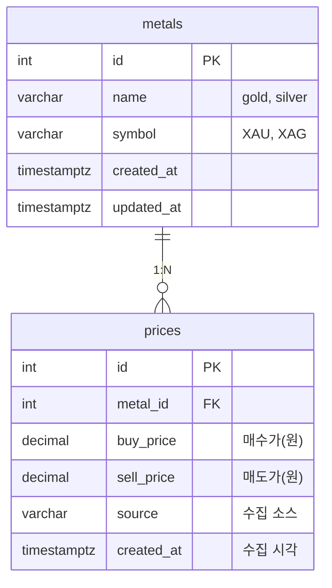

# ERD (Entity Relationship Diagram) — GoldSilver Now

> DB: PostgreSQL  
> MVP 기준 테이블: `metals`, `prices`

---

## 1. ERD 다이어그램 (Mermaid)

---

## 2. 테이블 정의

### 2.1 `metals` (금속 마스터)

| 컬럼 | 타입 | NULL | 기본값 | 설명 |
|------|------|------|--------|------|
| id | SERIAL / INTEGER | NO | nextval | PK |
| name | VARCHAR(32) | NO | — | 내부 식별명 (gold, silver) |
| symbol | VARCHAR(8) | YES | — | 심볼 (XAU, XAG) |
| created_at | TIMESTAMPTZ | NO | now() | 생성 시각 |
| updated_at | TIMESTAMPTZ | NO | now() | 수정 시각 |

- **유니크**: `name`
- **시드 데이터**: (1, 'gold', 'XAU'), (2, 'silver', 'XAG')

---

### 2.2 `prices` (시세 이력)

| 컬럼 | 타입 | NULL | 기본값 | 설명 |
|------|------|------|--------|------|
| id | SERIAL / BIGINT | NO | nextval | PK |
| metal_id | INTEGER | NO | — | FK → metals.id |
| buy_price | DECIMAL(12,2) | NO | — | 매수가 (원) |
| sell_price | DECIMAL(12,2) | NO | — | 매도가 (원) |
| source | VARCHAR(64) | YES | — | 수집 소스 (e.g. korea_gold_exchange) |
| created_at | TIMESTAMPTZ | NO | now() | 수집 시각 (기록 기준) |

- **인덱스**
  - `metal_id` (FK 조인·필터)
  - `(metal_id, created_at)` — 시계열 조회·차트 쿼리
  - 필요 시 `created_at` 단독 (전체 최신 N건)
- **FK**: `metal_id` REFERENCES `metals(id)` ON DELETE RESTRICT

---

## 3. 관계 요약

- **metals 1 : N prices**  
  한 금속(금/은)에 대해 여러 시점의 시세가 저장됨.
- 시세 조회 시 `metal_id` + `created_at` 범위로 필터링.

---

## 4. 확장 시 고려 (Phase 2)

- **alerts**: 사용자별 목표가 알림 (user_id, metal_id, target_price, notified_at 등)
- **sources**: 수집 소스 마스터 테이블 (id, name, url) — `prices.source`를 FK로 전환 가능
- **gold_temperature_index**: GTI 집계 결과 캐시 테이블 (date, metal_id, gti_value 등)

---

*이전: [01-crawler-design.md](./01-crawler-design.md) | 다음: [03-wireframe.md](./03-wireframe.md)*
